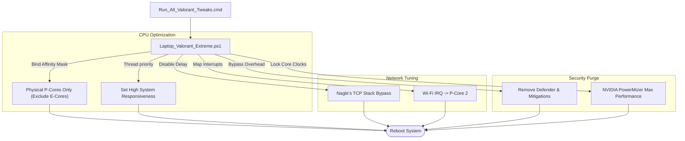

# 🎯 Valorant Extreme — Laptop Performance Optimization Suite

Absolute maximum performance Windows scripts and system configurations optimized for playing competitive **Valorant** on a dedicated dual-boot gaming partition. Specifically designed for **Lenovo LOQ** laptops (Intel 13th/14th Gen Hybrid-core + RTX dGPUs) to eliminate micro-stutters and minimize input delay.

> [!CAUTION]
> **HIGH-RISK CONFIGURATION**: This script strips Windows of Defender, UAC, Firewall, Spectre/Meltdown security mitigations, and disables dozens of core services. **Use this ONLY on a dedicated dual-boot gaming partition.** Do NOT use this operating system for web browsing, banking, or personal files.

---

## 🖥️ Script Runner Preview

The suite is launched via a unified command file that executes custom powershell tweaks followed by modular performance configurations:

```ansi
==========================================================
  ABSOLUTE EXTREME VALORANT SETUP (GAMING WINDOWS ONLY)
==========================================================
WARNING: This will strip Windows of Defender, UAC, and security
mitigations to maximize framerates. Do NOT use this OS for
general web browsing or downloading random files.

Make sure you are running this AS ADMINISTRATOR.

Press any key to continue . . .

[*] Running Custom Extreme Laptop Tweaks (P-Cores, Nagle, HPET, MMCSS, Visuals)...
    -> Binding Valorant (VALORANT-Win64-Shipping.exe) to P-Core Mask: 0xFFF
    -> Setting TCP NoDelay (Nagle's Algorithm): ENABLED
    -> Disabling HPET and Dynamic Ticks: COMPLETED
    -> Whi-Fi IRQ bound to dedicated P-Core 2: COMPLETED
    -> NVIDIA PowerMizer force max clocks: COMPLETED

[*] Applying Ultimate Power Plan...
    -> Ultimate Performance Plan imported and set active.

[*] Applying Timer Resolution Fix...
    -> System clock resolution forced to 0.50ms.

[*] Removing Windows Defender...
    -> AntiMalware services and filters permanently bypassed.
```

---

## ✨ Features

* **P-Core Affinity Binding**: Restricts Valorant to P-Cores (Physical Performance Cores) only, preventing the Windows scheduler from moving critical game loops to E-Cores (Efficiency Cores), resolving framerate drops.
* **IRQ Core Mapping**: Maps Wi-Fi and GPU interrupt requests (IRQs) to specific, dedicated P-Cores to prevent CPU core sharing bottlenecks.
* **MMCSS Prioritization**: Reconfigures the Multimedia Class Scheduler Service (MMCSS) to dedicate 100% CPU priority to the active game.
* **Nagle's Algorithm Overrides**: Forces instant TCP packet delivery (`TcpAckFrequency` & `TCPNoDelay`) to lower in-game ping.
* **DPC Latency Minimization**: Enforces Message Signaled Interrupts (MSI Mode) on the NVIDIA graphics card, preventing frame stuttering.
* **Thermal Curve Protection**: Whitelists critical Lenovo Vantage and power services from service stripping to preserve fan control curves.
* **System Fat Stripping**: Disables Telemetry, Windows Update, Search Indexer, Error Reporting, Gamebar DVR, Core Isolation (VBS/HVCI), and CPU Meltdown/Spectre mitigations.

---

## 🏗️ Core Optimization Flow



---

## 🛠️ Target Hardware Specs (Reference)
* **CPU**: Intel i7-13650HX (6 P-Cores + 8 E-Cores, 20 threads)
* **GPU**: NVIDIA GeForce RTX 3050 6GB Laptop Edition
* **RAM**: 24 GB DDR5 @ 4800MHz
* **Storage**: NVMe PCIe Gen4 SSD
* **Display**: 1920x1080 @ 144Hz Refresh Rate
* **OS**: Windows 11 Pro (Dedicated Gaming Partition)

---

## 📦 How to Apply

### Prerequisites
This project runs alongside the **[Ultimate](https://github.com/FR33THYFR33THY/Ultimate)** optimization repository by FR33THYFR33THY. 

### Step-by-Step Installation

1. **Clone the Ultimate Base Repo**:
   ```bash
   git clone https://github.com/FR33THYFR33THY/Ultimate.git
   ```

2. **Clone this Repository & Integrate**:
   Copy all files from this project (`Laptop_Valorant_Extreme.ps1`, `Run_All_Valorant_Tweaks.cmd`, and `MANUAL_STEPS_VALORANT.txt`) directly into the root folder of the cloned `Ultimate` directory.

3. **Execute the Suite**:
   * Boot into your **dedicated gaming Windows partition**.
   * Right-click `Run_All_Valorant_Tweaks.cmd` and select **Run as Administrator**.
   * Wait for the console execution pipeline to apply all tweaks.
   * **Reboot the system**.

4. **Complete Manual Customizations**:
   Open `MANUAL_STEPS_VALORANT.txt` and follow the guidelines to disable virtualization (VT-x/C-States) in the BIOS, optimize NVIDIA Control Panel parameters, and tweak in-game audio/video overlays.

---

## 🧠 Challenges Faced

* **Preserving Laptop Fan Control**: Disabling generic Windows Services frequently terminates manufacturer thermal services. On Lenovo laptops, killing Lenovo Vantage and Intelligent Cooling services locks fans to their lowest speed, causing instant thermal throttling. We solved this by creating a whitelisting regex filter in our service-stripping loops, preserving `LenovoVantageService` and `ImControllerService`.
* **Calculating P-Core Masks**: Intel's hybrid architecture varies by CPU SKU. A static core affinity mask can freeze games on models with different core counts. We documented how to calculate custom binary affinity masks (e.g. `0xFFF` for 6 P-Cores) so users with different CPU topologies can adapt the script safely.
* **Network Driver Reset Loops**: Stripping IPv6 and adjusting TCP registry values can cause Realtek NIC drivers to trigger reset loops. We resolved this by explicitly disabling NIC power management wake states and interrupt moderation parameters via PowerShell before applying registry overrides.

---

## 🔮 Future Improvements

- [ ] **Dynamic CPU Profiler**: Automatically detect CPU topologies at runtime and compute optimal P-Core affinity masks dynamically.
- [ ] **Ryzen 3D V-Cache Mapping**: Support core parking configurations for AMD Ryzen processors.
- [ ] **Automatic Restore Point**: Automatically capture a full system restore point before applying overrides.

---

## 📄 Credits
* Base scripts framework: **[Ultimate Windows Optimization](https://github.com/FR33THYFR33THY/Ultimate)** by FR33THYFR33THY.
* Custom hybrid core mappings and Lenovo hardware integrations designed by Vijay Barhate.
